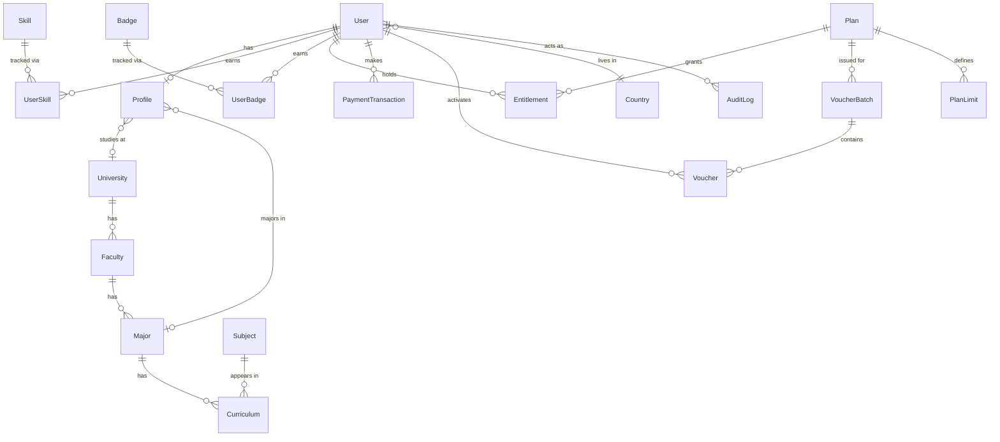

# EngUvers — Entity Relationship Diagram (Phase 0-1 scope)

Source of truth for the actual schema is
[`apps/api/prisma/schema.prisma`](../apps/api/prisma/schema.prisma) — this
document is the readable companion, updated at the start of each phase
that adds tables. Later phases (courses, exams, projects, circuit-lab
saves, marketplace, etc.) extend this diagram; they are not designed yet.

## Notes

- **`Entitlement` is the single gate** every feature route/UI checks
  (`entitlements.can(userId, 'circuit_lab.esp32')`). No feature branches on
  `user.plan === 'x'` directly — see `packages/types/src/index.ts` for the
  `EntitlementFeature` union and `PlanLimit` shape.
- **`Major`/`University`/`Faculty` are optional on `Profile`** — the
  onboarding flow's "browse generally" path (brief §5) leaves them null;
  content that isn't curriculum-bound is not tied to any of these.
- **`Voucher.codeHash`**, never the plaintext code, is stored — the plain
  code is shown once at generation/redemption time only.
- **`AuditLog`** is generic (`entityType` + `entityId` + `metadata` JSON)
  so it doesn't need a new column set per phase; every admin-affecting
  action (voucher batch creation, entitlement grants, content moderation)
  writes here.
