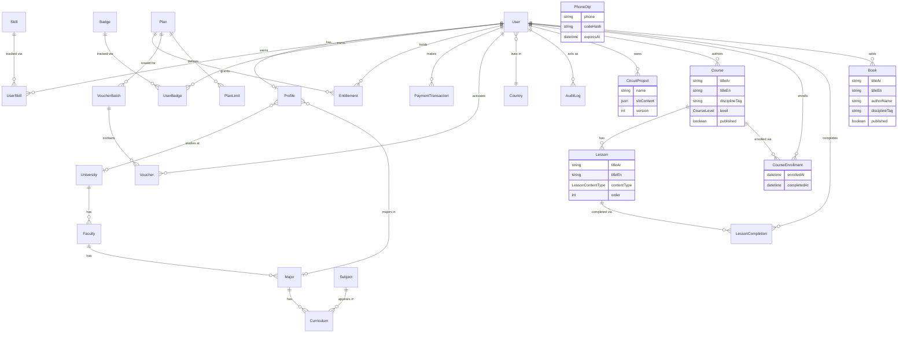

# EngUvers — Entity Relationship Diagram (Phase 0-3 scope)

Source of truth for the actual schema is
[`apps/api/prisma/schema.prisma`](../apps/api/prisma/schema.prisma) — this
document is the readable companion, updated at the start of each phase
that adds tables. Later phases (courses, exams, projects, circuit-lab
saves, marketplace, etc.) extend this diagram; they are not designed yet.

## Notes

- **`Entitlement` is the single gate** every feature route/UI checks
  (`entitlements.can(userId, 'circuit_lab.esp32')`). No feature branches on
  `user.plan === 'x'` directly — see `packages/types/src/index.ts` for the
  `EntitlementFeature` union and `PlanLimit` shape. Implemented for real in
  Phase 1: `EntitlementsService`, `EntitlementsGuard` +
  `@RequireEntitlement()`, `GET /me/entitlements`. No feature route uses
  the guard yet — the gated features (circuit lab, academy, exams, ...)
  start in Phase 2+.
- **`Major`/`University`/`Faculty` are optional on `Profile`** — the
  onboarding flow's "browse generally" path (brief §5) leaves them null;
  content that isn't curriculum-bound is not tied to any of these.
  `Major.disciplineTag` + `Major.nameEn @unique` were added in Phase 1
  (all seeded majors are generic/faculty-less, see `prisma/seed.ts`).
- **`Voucher.codeHash`**, never the plaintext code, is stored — the plain
  code is shown once at generation/redemption time only.
- **`AuditLog`** is generic (`entityType` + `entityId` + `metadata` JSON)
  so it doesn't need a new column set per phase; every admin-affecting
  action (voucher batch creation, entitlement grants, content moderation)
  writes here.
- **`PhoneOtp`** (added Phase 1): short-lived phone-verification codes,
  hashed at rest, consumed on first correct match. The SMS side is a
  swappable `OtpProvider` (`apps/api/src/auth/otp/`) — the dev default
  (`ConsoleOtpProvider`) logs the code instead of sending it, since no
  real SMS gateway is configured yet (see CLAUDE.md's deferred inputs).
- **`CircuitProject`** (added Phase 2): one row per saved Circuit Lab
  workspace. `vlxContent` is the whole `.vlx` JSON payload — the same
  format Velxio's own file export/import uses (see
  `services/simulator/README.md`), so a project round-trips as a
  downloadable file too, not just through the app. `version` is a plain
  optimistic counter bumped on every autosave — not a version-history
  table (no phase needs one yet).
- **`Course`/`Lesson`/`CourseEnrollment`/`LessonCompletion`** (added
  Phase 3, Engineering Academy/EA): a `Course` is authored by an
  `admin`/`instructor` (role-gated content-admin routes under
  `/admin/academy`) and becomes enrollable once `published`. A
  `CourseEnrollment.completedAt` is stamped once every one of the
  course's `Lesson` rows has a matching `LessonCompletion` for that user
  — see `AcademyService.completeLesson`. Gated behind the existing
  `academy.courses` `EntitlementFeature`, granted to the `free` plan in
  `prisma/seed.ts` (unlike `ise.analysis`, this feature has no missing
  external dependency, so it isn't left ungated). No quiz/exam model yet
  — that's EE, a later Phase 3 slice.
- **`Book`** (added Phase 3, Engineering Books/EB): a flat catalog, no
  lessons/enrollment the way courses have. `fileUrl` is deliberately
  never returned by the public catalog/detail endpoints — only by the
  entitlement-gated `GET /library/books/:id/access` (`library.books`,
  also granted to `free`) — see `LibraryService`.
